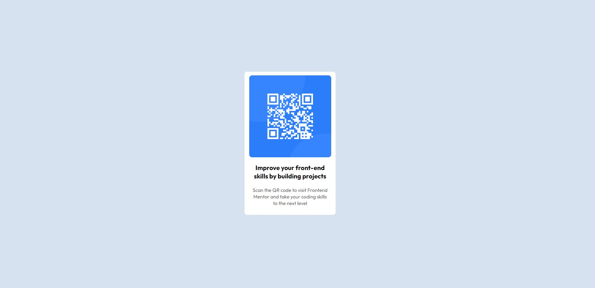

# QR code component solution

This is a solution to the [QR code component challenge on Frontend Mentor](https://www.frontendmentor.io/challenges/qr-code-component-iux_sIO_H). Frontend Mentor challenges help you keep my coding skills by building realistic projects. 

## Table of contents

- [QR code component solution](#qr-code-component-solution)
  - [Table of contents](#table-of-contents)
  - [Overview](#overview)
    - [Screenshot](#screenshot)
    - [Links](#links)
  - [My process](#my-process)
    - [Built with](#built-with)
    - [Description](#description)
  - [Author](#author)

**Note: Delete this note and update the table of contents based on what sections you keep.**

## Overview

### Screenshot

### Links

- Solution URL: [URL](https://reinosobs.github.io/qr_card_component/)
- Live Site URL: [URL](https://reinosobs.github.io/qr_card_component/)

## My process

### Built with

- Semantic HTML5 markup
- CSS custom properties
- Flexbox
- CSS Grid
- Mobile-first workflow

### Description

Simple QR card component that can be used to display a qr card into a website. Project created to refresh my HTML and CSS skills.

## Author

- Website - [Add your name here](https://reinosobs.github.io/portfolio-react/)
- Frontend Mentor - [@reinosobs](https://www.frontendmentor.io/profile/reinosobs)
